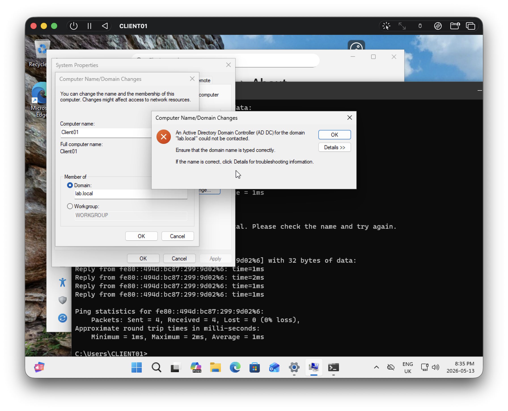
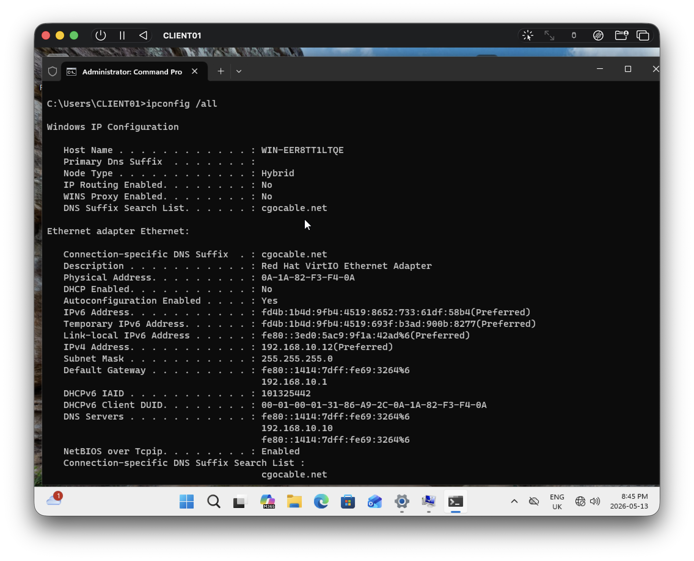
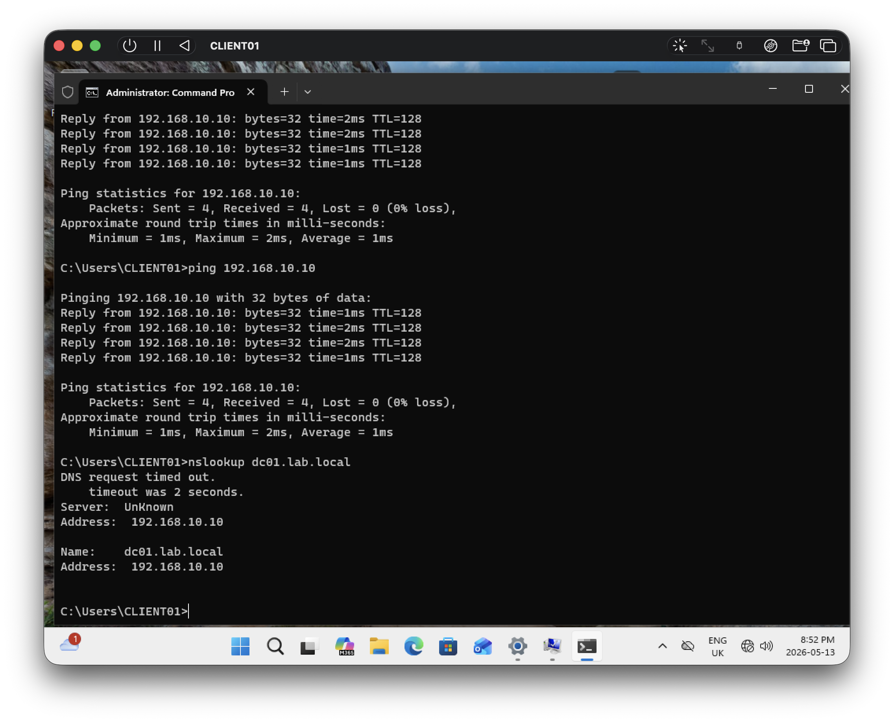

## Problems Encountered

### DNS Resolution Issue

Symptoms:

- `ping server01` failed
- `ping server01.lab.local` worked
- Domain join failed
    
Investigation:

- Ran `ipconfig /all`
- Used `nslookup`
- Found provider DNS suffix interference
    
Resolution:

- Removed incorrect DNS configuration
    
## Lessons Learned

- DNS is often the root cause of domain join failures
- FQDN behavior can reveal suffix issues
- Always validate client DNS configuration first
