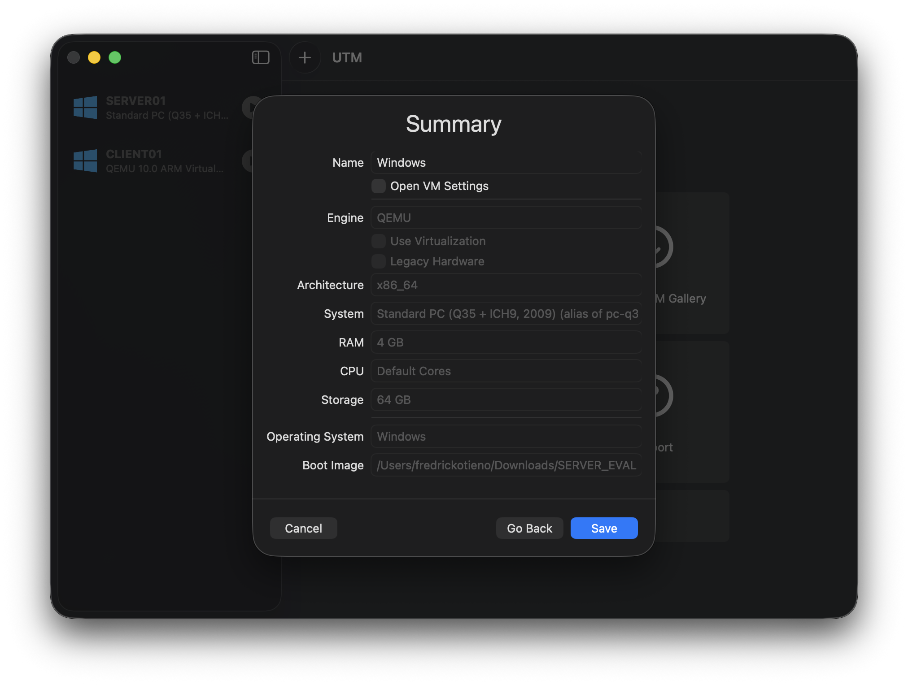
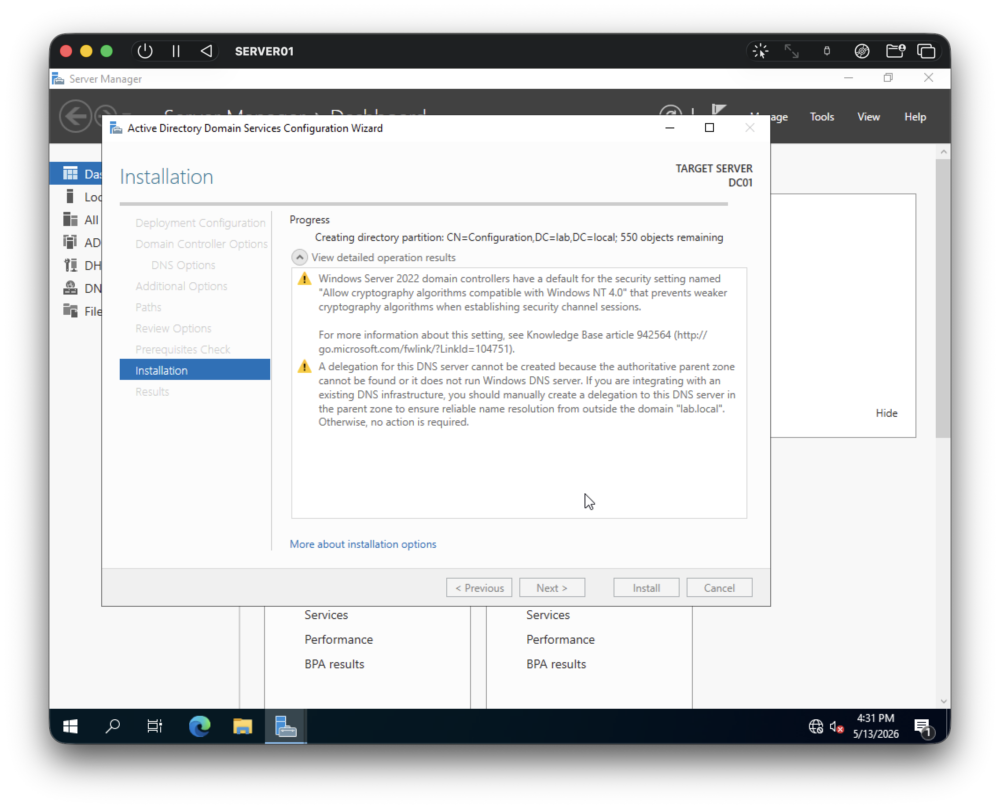

## Setup Procedure

### Step 1 — Deploy Server VM

- Create Windows Server 2022 VM in UTM
- Configure CPU/RAM allocation
- Configure static IP

Screenshot:

---

### Step 2 — Install Server Roles

Installed:

- Active Directory Domain Services
- DNS
- DHCP

Screenshot:

---

### Step 3 — Promote Server to Domain Controller

Configured:

- Domain: `lab.local`
- Hostname: `DC01`

---

### Step 4 — Configure Client

Actions:

- Configure DNS to point to DC01
- Verify network connectivity
- Join domain

